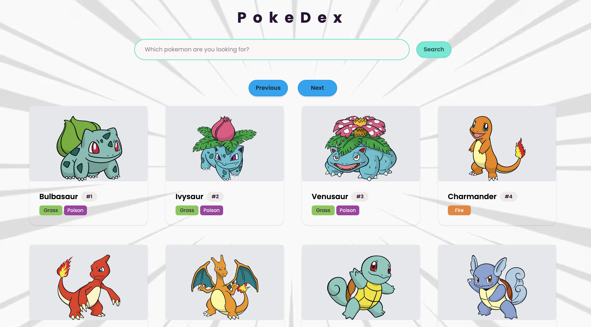
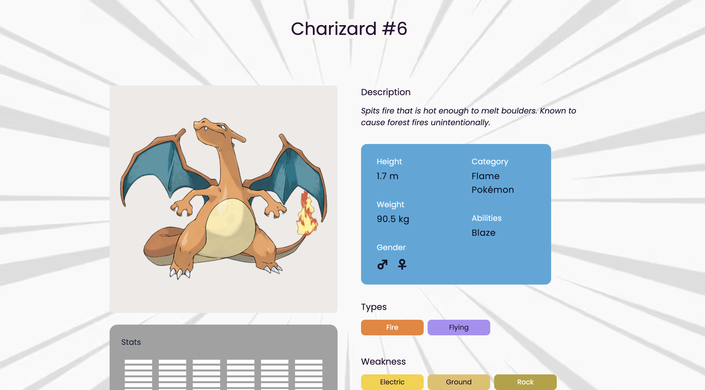

# PokeDex-App

A clean, lightweight Pokédex web application to browse, search and view detailed information about Pokémon. Built for learning and demonstration purposes.

---

## Demo

> Demo: <https://poke-dex-app-seven.vercel.app/>

---

## Screenshots

### Home Page

|                                            |
| ------------------------------------------ |
|  |

### Details Page

|                                                  |
| ------------------------------------------------ |
|  |

---

## Features

- Browse a paginated list of Pokémon
- Search Pokémon by name (type-ahead)
- View detailed Pokémon pages (stats, abilities, sprites)
- Responsive layout for mobile and desktop

---

## Tech Stack

> Replace or update these with the frameworks and tools you used.

- **Framework:** React (Vite)
- **Styling:** CSS / Sass / Tailwind CSS
- **Data source:** [PokéAPI](https://pokeapi.co/)
- **Bundler:** Vite
- **Hosting:** Vercel

---

## Project Structure

```lua
PokeDex-App/
├─ public/
│  └─ index.html
├─ src/
│  ├─ components/
│  │  ├─ Header.jsx
│  │  ├─ PokemonCard.jsx
│  │  ├─ PokemonList.jsx
│  │  └─ PokemonDetail.jsx
│  ├─ pages/
│  │  ├─ Home.jsx
│  │  └─ Details.jsx
│  ├─ hooks/
│  │  └─ useFetchPokemon.js
│  ├─ utils/
│  │  └─ helpers.js
│  ├─ assets/
│  ├─ App.jsx
│  └─ main.jsx
├─ .gitignore
├─ package.json
└─ README.md
```

---

## Installation

> Update commands to match your project (npm / yarn / pnpm).

```bash
# clone the repo
git clone https://github.com/Sagnik-mkh/PokeDex-App.git
cd PokeDex-App

# install dependencies
npm install
# or
# yarn

# start development server
npm run dev
# or
# npm start
```

---

## Usage

1. Start the dev server.
2. Open `http://localhost:3000` (or the port shown in the console).
3. Browse the list, search by name, and click a Pokémon card to open details.

---

## API

This project uses the free [PokéAPI](https://pokeapi.co/). Example endpoints used:

- `https://pokeapi.co/api/v2/pokemon?limit=20&offset=0` — list
- `https://pokeapi.co/api/v2/pokemon/{name or id}` — details

**Notes:** Cache responses where possible. Consider server‑side pagination to reduce requests.

---

## Performance & Accessibility

- Lazy‑load images and sprites
- Use `aria-*` attributes for screen readers
- Ensure contrast and keyboard navigation

---

## Deployment

Deploy with Vercel/Netlify/GitHub Pages. Example for Vercel:

1. Connect GitHub repo
2. Set build command (`npm run build`) and output directory (`dist` or `build`)
3. Deploy

---

## Contributing

Contributions are welcome! Steps:

1. Fork the repo
2. Create a feature branch (`git checkout -b feature/your-feature`)
3. Commit your changes (`git commit -m "feat: add ..."`)
4. Push (`git push origin feature/your-feature`)
5. Open a Pull Request

---

## Roadmap / Ideas

- Add favorites / bookmarks
- Add offline support with service workers
- Add animations for sprite transitions
- Add unit/integration tests and CI
- Add light/dark theme
- Filter by type (e.g., Fire, Water)

---

## License

```bash
Permission is hereby granted, free of charge, to any person obtaining a copy
```

---

## Contact

Sagnik — [sagnikm003@gmail.com](mailto:sagnikm003@gmail.com)

---
